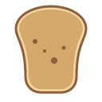

[](https://search.maven.org/artifact/ro.cosminmihu.toast/toast)
[](https://github.com/CosminMihuMDC/toast/blob/main/LICENSE)
[](http://makeapullrequest.com)
[](https://developer.android.com)
[](https://github.com/CosminMihuMDC/toast)
[](https://github.com/CosminMihuMDC/toast/fork)

#  Toast

Toast is a library that provides a simple Kotlin DSL for creating and displaying toasts on Android.

## Setup

### 

```kotlin  
dependencies {
    implementation("ro.cosminmihu.toast:toast:1.0.0")
}  
```  

## 🧩 Integration

Check out below how to integrate Toast.

```kotlin  
toast {  
    message("Toast message")
    message(R.string.message_toast)
    short() // by default
    long()
    position(Gravity.BOTTOM or Gravity.CENTER_HORIZONTAL) {
        xOffset = 0 // by default
        yOffset = 0 // by default
    }
    onShown { /* toast is shown */ }         // API level 30 (Android R) and above
    onDismiss { /* toast is dismissed */ }   // API level 30 (Android R) and above
}
```  

## ✍️ Feedback

Feel free to send feedback or [file an issue](https://github.com/CosminMihuMDC/Toast/issues/new).

## 🙌 Acknowledgments

Thanks to JetBrains and [Kotlin](https://kotlinlang.org)!

## 💸 Sponsors
Toast is maintained and improved during nights, weekends and whenever team has free time. If you use Toast in your project, please consider sponsoring us.

You can sponsor us by clicking <span style="color:#bf3989">♥ Sponsor</span> Button.

## 🙏🏻 Credits

Toast is brought to you by these [contributors](https://github.com/CosminMihuMDC/toast/graphs/contributors).
